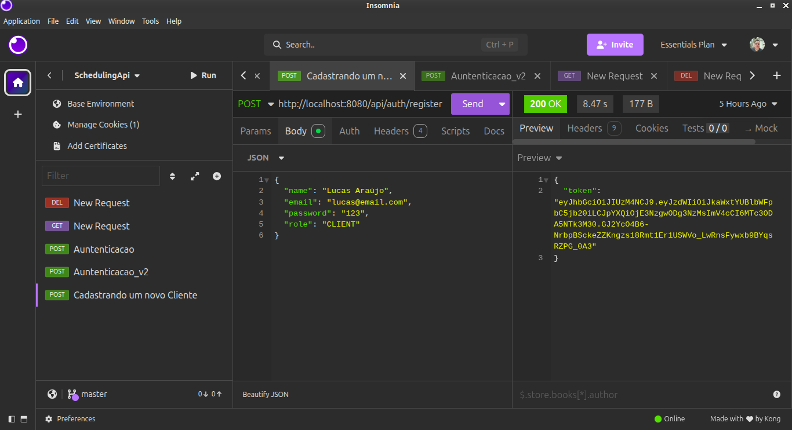
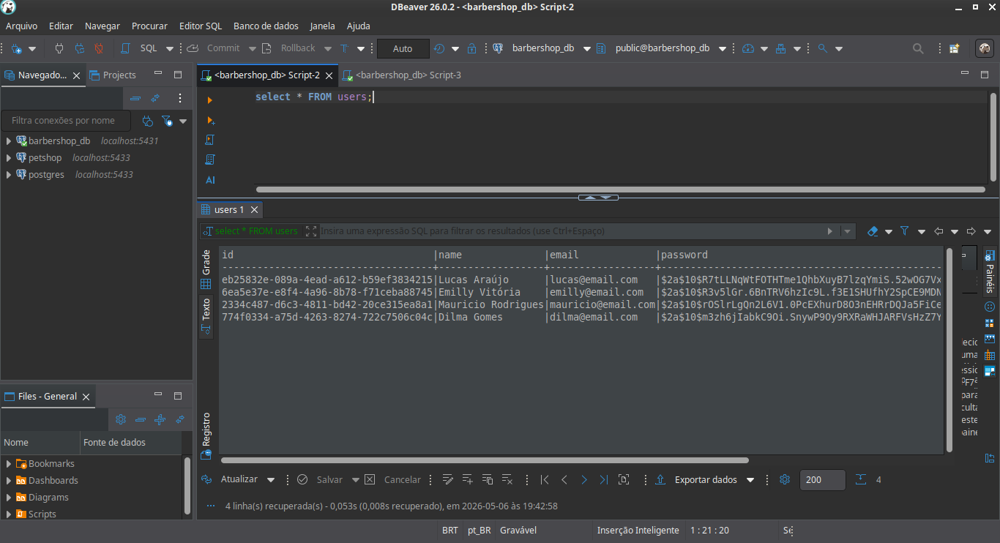
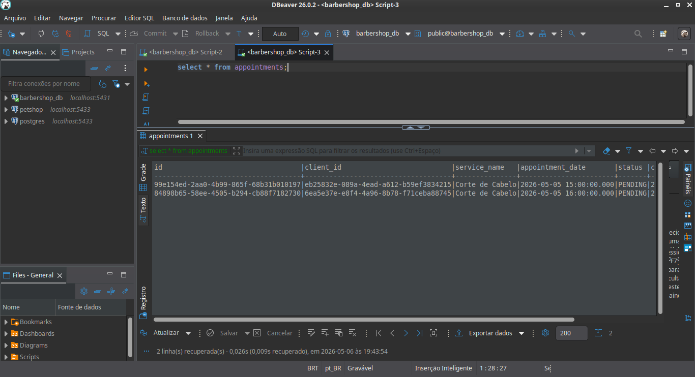
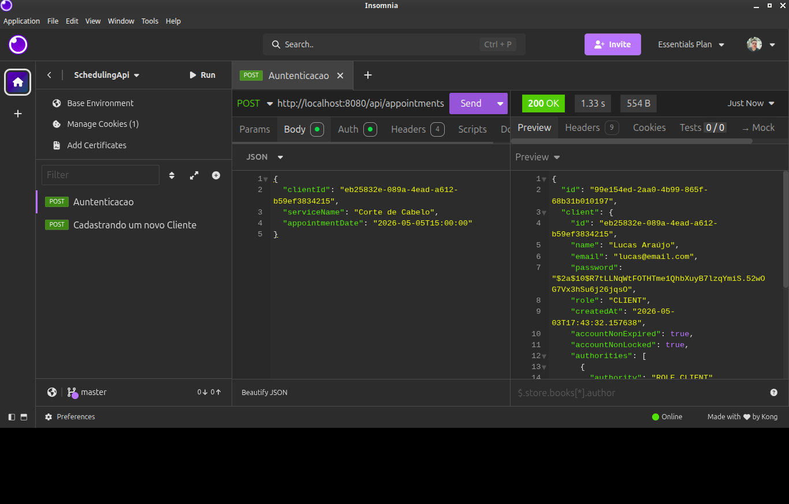
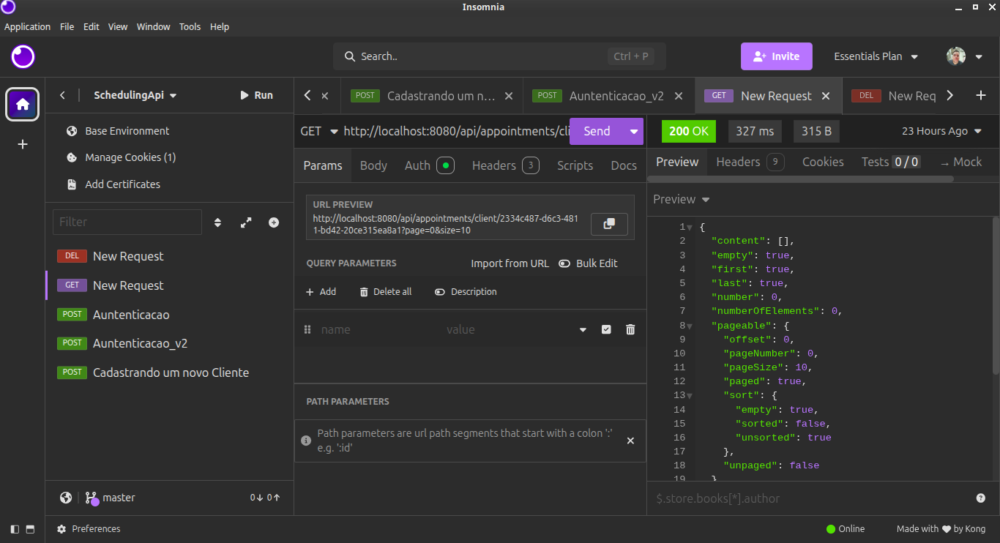
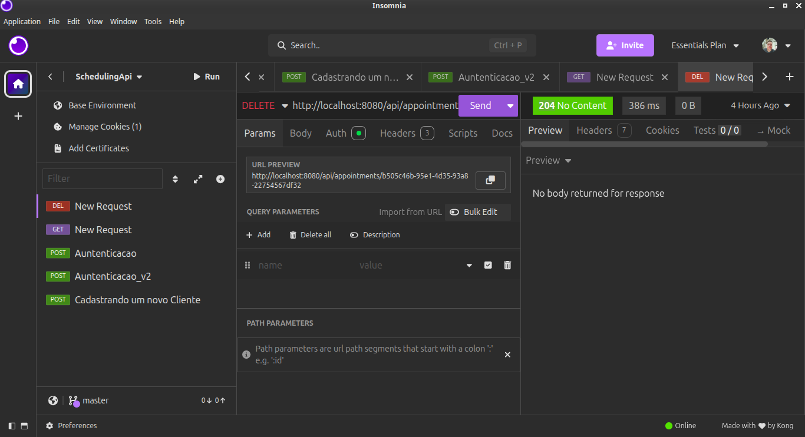
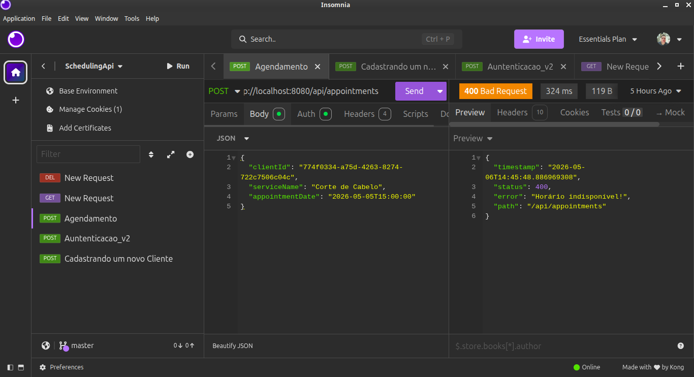

# Scheduling API - BarberShop

Uma API RESTful desenvolvida em Spring Boot para gerenciamento de agendamentos de uma barbearia. O sistema permite o cadastro de clientes, autenticação segura, e o gerenciamento completo de horários, garantindo que não haja conflito de agendamentos.

## Tecnologias Utilizadas
* **Java 21**
* **Spring Boot 3** (Web, Data JPA, Security, Validation)
* **PostgreSQL** (Banco de Dados Relacional)
* **JWT (JSON Web Tokens)** (Autenticação e Autorização)
* **Springdoc OpenAPI / Swagger** (Documentação Interativa)
* **Maven** (Gerenciador de Dependências)

## Funcionalidades

* **Autenticação e Segurança:** 
  * Registro de novos clientes com senha criptografada (BCrypt).
  * Login com geração de token JWT.
  * Rotas protegidas que exigem token válido.

* **Agendamentos (Appointments):**
  * Criação de agendamentos vinculados ao cliente logado.
  * Validação contra horários duplicados/conflitantes.
  * Listagem do histórico de agendamentos por cliente com **paginação**.
  * Cancelamento (exclusão) de agendamentos existentes.
* **Boas Práticas aplicadas:**
    * Uso de **DTOs** (Data Transfer Objects) para blindar dados sensíveis (como senhas) no retorno das requisições.
    * **Tratamento Global de Erros** (`@RestControllerAdvice`) retornando JSONs limpos e padronizados para erros (ex: 400 Bad Request, 403 Forbidden).

## Como Executar o Projeto Localmente

**Pré-requisitos:**
* Java Development Kit (JDK) instalado.
* PostgreSQL rodando localmente (recomendado usar DBeaver para visualização).
* Maven.

1. **Clone o repositório:**
   ```bash
   git clone [https://github.com/lucasaarj/scheduling-api.git](https://github.com/SEU_USUARIO/scheduling-api.git)
   cd scheduling-api

2. **Configure o Banco de dados e a chave Secreta**
  ```bash
   // src/main/resources/application.properties

   spring.datasource.url=jdbc:postgresql://localhost:5432/barbershop_db
   spring.datasource.username=seu_usuario
   spring.datasource.password=sua_senha
   spring.jpa.hibernate.ddl-auto=update
   
   # Chave secreta para assinar o JWT (Use uma string complexa em produção)
   api.security.token.secret=sua_chave_secreta_super_segura_aqui

```

# Fotos do Projeto rodando:

1. Imagem cadastrando usuário e gerando o seu respectivo token:



2. Usuários Criados no banco de dados:



3. Agendamentos salvos no banco de dados:



4. Autenticação gerada com sucesso:



5. Método GET funcionando com sucesso:



6. Método DELETE funcionando com sucesso:



7. Marcação de Agendamentos caindo no GlobalExceptionHandler:


